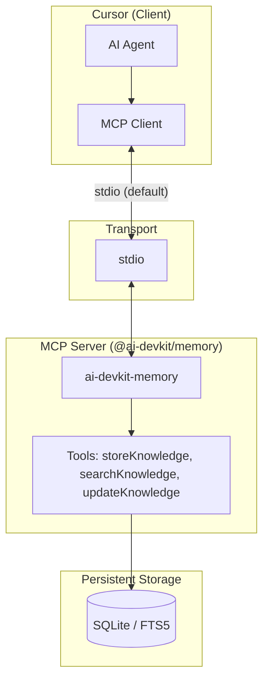

# 1. EFFECTIVE FEATURE DESIGN

## 1.1 Feature Definition
* **Noun (The Tool):** Integration layer and configuration that enables ai-devkit v0.13.0 Persistent Memory (MCP) and Skills in this workspace.
    * *Core Function:* Connects Cursor (client) to @ai-devkit/memory (MCP server); adds init template and Skills setup without overwriting existing `docs/ai/` or `docs/project_handoff.md`.

## 1.2 Init Template Mode (Open Question — Resolved)

**CLI flag and behaviour (from local ai-devkit v0.13.0):**

- **Flag:** `ai-devkit init -t <path>` (or `--template <path>`).
- **Supported formats:** Template file with extension `.yaml`, `.yml`, or `.json`.
- **Allowed template fields:** `version`, `environments`, `phases`, `skills` (no custom template paths; init always writes to `docs/ai/<phase>/README.md` from the package’s built-in phase templates).

**Merge without overwriting `docs/ai/`:**

- With `-t`, if a phase file already exists, init **overwrites** it (no merge of content). To **preserve** existing Requirements, Design, and Planning READMEs:
  - Use a template that **omits `phases` or sets `phases: []`**. Then init will not copy any phase files (it will report "No phases selected" for the phase step but still apply **environments** and **skills**).
  - **Exact configuration:** Create a YAML or JSON init template containing only `environments` and optionally `skills`. Do **not** include `phases`, or set `phases: []`.

**Example template (e.g. `ai-devkit-init-merge.yaml`) for this workspace:**

```yaml
version: "0.13.0"
environments:
  - cursor
# phases omitted or set to [] so docs/ai/ is never overwritten
phases: []
skills: []   # optional: add entries like { registry: "https://...", skill: "name" }
```

**Run command:** `npx ai-devkit init -t ai-devkit-init-merge.yaml -e cursor` (or pass template path and environment). Do **not** use `-a` or `-p` with phase names when running init, so no phase files are selected.

## 1.3 Effectiveness Attributes
* **Sustainability Adjectives (Robustness):**
    * *Adjective:* Fault-Tolerant (no accidental overwrite of user templates).
    * *Implementation Strategy:* Use only init with template that has no phases; document the exact command and template in implementation/runbooks.

* **Efficiency Adjectives (Optimization):**
    * *Adjective:* Lightweight.
    * *Implementation Strategy:* Rely on existing ai-devkit and @ai-devkit/memory; no duplicate storage or custom server logic.

* **Scalability Adjectives (Volume):**
    * *Adjective:* Modular.
    * *Implementation Strategy:* MCP and Skills are additive; future phases or skills can be added via template or CLI without touching existing docs.

## 1.4 Architecture & Data

**Visual Map: Cursor ↔ @ai-devkit/memory (this workspace)**



- **Cursor** runs the MCP server as a subprocess via `.cursor/mcp.json` (command: `npx -y @ai-devkit/memory`). The AI agent in Cursor uses the MCP client to call tools exposed by the server.
- **@ai-devkit/memory** exposes MCP tools: `memory.storeKnowledge`, `memory.searchKnowledge`, `memory.updateKnowledge`. Storage is local (e.g. SQLite with FTS5) in a path determined by the package (project/repo scope when applicable).

**Data / interfaces:**

- **MCP tool inputs (representative):** `title`, `content`, `tags`, `scope` (store); `query`, `tags`, `scope`, `limit` (search); `id` + optional `title`/`content`/`tags`/`scope` (update). Outputs are JSON (e.g. `id`, `results`).
- **Config files:** `.cursor/mcp.json` (project-level MCP servers); `.ai-devkit.json` (environments, initialized phases, version). No change to `docs/ai/requirements/README.md`, `docs/ai/design/README.md`, `docs/ai/planning/README.md`, or `docs/project_handoff.md` unless the user edits them.

## 1.5 Resource Impact Analysis (Approach 2: 90% Risk / 10% Output)

This section reflects **Approach 2:** Success = Efficient and Scalable managing of failure risks = **90% resources on minimising failure risks**, **10% driving output.**

| Resource allocation | Proportion | Application to this feature |
|--------------------|------------|-----------------------------|
| **Risk management** | **90%** | Validation of init template (no phases) before any run; backup or version-control of `docs/ai/` and `docs/project_handoff.md` before first init with `-t`; documenting exact commands and template; testing init in a copy of the repo or a branch; ensuring MCP config does not expose secrets; rollback plan (restore docs from git). |
| **Output / delivery** | **10%** | Adding `.cursor/mcp.json` for ai-devkit-memory; adding init template file and running init once; enabling Skills via template or CLI as needed. |

**Financial Impact (OpEx):**

- External costs: None (local CLI + local MCP server and SQLite).
- Projected monthly run rate: $0 (no hosted services required for this integration).

**Build cost (one-time):**

- Time to build: Low (config + template + docs).
- Complexity risk: Low if template and runbook are followed; **High** if init is run with phases or without template and overwrites custom docs.

**ROI / alignment:**

- Value: Enables Persistent Memory and Skills without losing custom phase templates or Approach 2.
- Alignment: Fits “Efficiency” and “Sustainability” by avoiding rework and protecting existing docs; resource split (90% risk / 10% output) is explicitly applied in this section.

## 1.6 Key Design Decisions & Non-Functional Requirements

**Decisions:**
- Use **init with template only** (no phases) to add v0.13.0 capabilities; never run `init -a` or `init -p requirements,design,...` so custom phase READMEs are never overwritten.
- Use **project-level** `.cursor/mcp.json` so Memory MCP is versioned and shared with the repo; command `npx -y @ai-devkit/memory` (stdio).
- **Resource Impact** is defined in line with Approach 2 (90% risk management, 10% output); approval and runbooks must follow that split.

**Non-functional requirements to preserve:**
- **Security:** No secrets in template or MCP config; storage remains local (SQLite).
- **Correctness:** Existing `docs/ai/` and `docs/project_handoff.md` remain the single source of truth unless the user explicitly edits them.
- **Repeatability:** Same init template and commands can be run in a clean clone to reproduce setup; rollback = git restore of docs and config.
