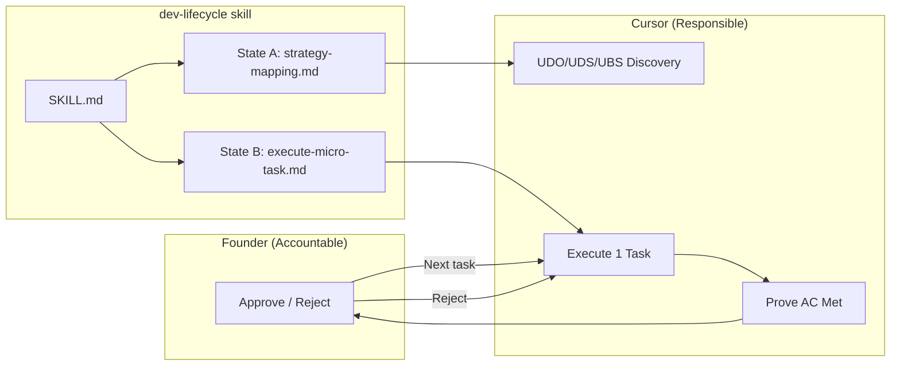

# 1. THE SYSTEM DESIGN (Context & Bridge)
*This section maps the approved Phase 2 from the Requirements document into the physical/digital space.*

* **Principles (Why):** Deterministic verification; no AI advancement without Founder approval; grammar-owned execution (Verbs/Nouns/Adverbs under Founder control).
* **Environment (Where):** `.cursor/skills/dev-lifecycle/` — the Cursor skill directory that routes the Agent.
* **Tools (What):** 
  * *State A — Strategy Engine:* `strategy-mapping.md` (UDO/UDS/UBS discovery and mapping).
  * *State B — Execution Loop:* `execute-micro-task.md` (1-to-1 task execution with hard stop for Founder validation).
  * *Routing:* `SKILL.md` points only to these two states.
* **SOP (How):** Destroy the 8-step Waterfall; implement the 2-State Engine. Agent runs State A for strategy/causal map; State B for one micro-task at a time with validation gate.

---

# 2. TECHNICAL ARCHITECTURE (The Noun)
*Goal: Provide clear, material explanation of the architecture so the Founder/User fully understands how the Wrapper and Core physically operate.*

* **Feature Noun:** The 2-State Engine — two reference files (`strategy-mapping.md`, `execute-micro-task.md`) plus `SKILL.md`, all under `.cursor/skills/dev-lifecycle/`.

## 2.1 Visual Map (Mermaid)

## 2.2 Component Mapping
* **State A (Strategy Engine):** `strategy-mapping.md` contains the prompt/SOP that forces the Agent to run the UDO/UDS/UBS discovery loop (aligned to `docs/ai/frameworks/effective-system-design.md`). Output: causal map and system design that feed the planning doc. No code execution; only discovery and doc production.
* **State B (Execution Loop):** `execute-micro-task.md` contains the prompt/SOP that: (1) loads one task from the planning doc; (2) executes only that task; (3) presents evidence that the task's Acceptance Criteria are met; (4) STOPS and waits for Founder approval; (5) does not proceed to the next task until approval. Integration with ai-devkit CLI and MCP Memory must not crash when the Agent is forced to stop.

## 2.3 Data Models & APIs
* **Inputs:** Planning doc (`docs/ai/planning/feature-{name}.md`) with tasks and Acceptance Criteria; optional strategy map from State A.
* **Outputs:** Updated docs/code per task; evidence summary for Founder validation.
* **No database.** State is the planning doc (task status) and the conversation (approval). ai-devkit Memory MCP may store governance rules; CLI used for skill/init as needed. No new schema.

---

# 3. EFFECTIVENESS ATTRIBUTES OF THE SOLUTION / ENABLEMENT (The Adjectives)
*How the feature attributes enable the user to reach the Effectiveness Outcomes.*

* **Sustainability (Risk/Safety):** Phase-gated, validation-gated. Every micro-task has explicit Acceptance Criteria; no "done" without Founder sign-off. Implementation: Acceptance Criteria written in planning doc; execute-micro-task.md instructs Agent to list evidence per criterion and stop.
* **Efficiency (Speed/Utility):** Minimal, deterministic. Only two states (strategy, execution); no ceremonial steps. Implementation: SKILL.md routes only to strategy-mapping.md and execute-micro-task.md; legacy 8-step files archived.
* **Scalability (Growth):** Modular, grammar-driven. Same 2-State flow for any feature. Implementation: Workspace docs updated to describe 2-State Engine as canonical; new features reuse the same skill entry points.

---

# 4. RESOURCE IMPACT (The "Price Tag")
* **Financial Cost (OpEx):** $0 (local skill files and docs).
* **Build Complexity:** Low (markdown prompts + SKILL.md routing; archive and create files).
* **ROI Sanity Check:** Yes. Removes administrative bloat and hallucination risk by enforcing 1-to-1 task execution and Founder validation.

---
