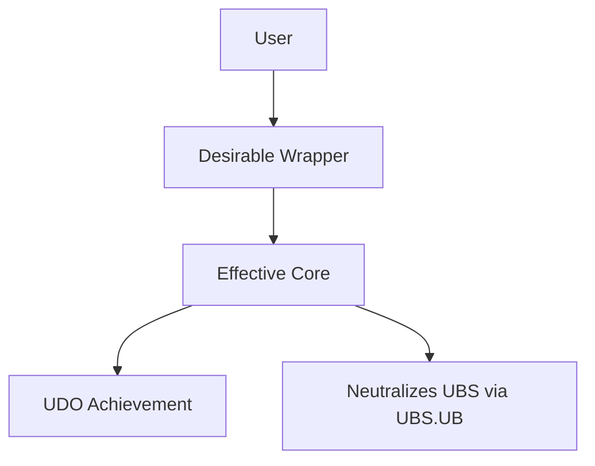

# Design — ESD Phase 2 Architecture

> **ESD Phase:** System Design → Physical/Digital Architecture
>
> This document captures **how** the system is built. The **what** and **when** live in Requirements and Planning. For methodology, reference `docs/ai/frameworks/effective-system-design.md` §2.

---

## Quick Reference: Design-to-Requirements Mapping

| Design Section               | Derives From                                | Outputs To                                  |
| :--------------------------- | :------------------------------------------ | :------------------------------------------ |
| **Principles**               | Requirements Phase 2 (EPS)                  | Component Mapping decisions                 |
| **Environment**              | Requirements Phase 2 (UES)                  | Technical Architecture §2                   |
| **Tools**                    | Requirements Phase 2 (Wrapper/Core concept) | §2.2 Component Mapping table                |
| **EOP**                      | Requirements Phase 2 (EOP outline)          | System Wiki §6 (detailed EOP after I4)      |
| **Effectiveness Attributes** | Requirements Phase 3 (Adjectives)           | §3 table (implementation strategy per A.C.) |
| **Resource Impact**          | Planning §3 (Budget Tracker)                | Hard limits for execution                   |

_Iteration mapping (ESD §6):_ Desirable Wrapper = Iterations 1–2 (Concept, Prototype); Effective Core = Iterations 3–4 (MVE, Leadership). Planning assigns A.C.s to iterations per ESD §6.

_For UBS/UDS/EPS definitions, see ESD §1.3._

---

# 0. DOCUMENT CONTROL (Design Doc)

_Lightweight traceability during I1–I4. Full Document Control lives in System Wiki §0.1 after I4._

| Field            | Value                          |
| :--------------- | :----------------------------- |
| **Feature**      | [feature name, kebab-case]     |
| **Version**      | [e.g. 0.1]                     |
| **Status**       | [Draft / In Review / Approved] |
| **Last updated** | [Date]                         |

---

# 1. THE SYSTEM DESIGN (Context & Bridge)

_ESD §2: Map the approved Phase 2 from Requirements into physical/digital space._

**Source:** EPS (Effective Principles), UES (Ultimate Enabling System), EOP outline from Requirements Phase 2.

| Element                 | Content                                                                                                                 |
| :---------------------- | :---------------------------------------------------------------------------------------------------------------------- |
| **Principles (Why)**    | [General/scientific principles governing drivers and blockers. ESD labels: P1(S), P2(S), P3(E), P4(E), P5(Sc), P6(Sc).] |
| **Environment (Where)** | [Physical/digital/cultural context — UES layers: Foundational / Operational / Enhancement.]                             |
| **Desirable Wrapper**   | [The hook/interface the user interacts with — aligns with UDO.]                                                         |
| **Effective Core**      | [The hidden mechanic solving root drivers/blockers — neutralizes UBS via UBS.UB.]                                       |
| **EOP (How)**           | [Step-by-step user action outline. Detailed EOP with per-step RACI in System Wiki §6 after I4.]                         |

---

# 2. TECHNICAL ARCHITECTURE (The Noun)

_ESD: Provide clear, material explanation of the architecture._

**Feature Noun:** [What specific Tool/Solution/Enablement are we building?]

## 2.1 Visual Map (Mermaid)

_ESD: Map user flow, Desirable Wrapper, and Effective Core._

_[Insert feature-specific Mermaid diagram]_

## 2.2 Component Mapping

_ESD: One row per component. Map to A.C. IDs delivered and implementation summary._

| Component             | A.C. IDs delivered                | Implementation summary                           |
| :-------------------- | :-------------------------------- | :----------------------------------------------- |
| [e.g. Wrapper / UI]   | [e.g. SustainAdj-AC1, EffAdj-AC1] | [How it is built; aligns with Wrapper/Core.]     |
| [e.g. Core / backend] | [e.g. Noun-AC1, SustainAdv-AC1]   | [How it implements principles and delivers A.C.] |

_Add rows as needed. Do not invent A.C.; reference Requirements Phase 3 and Planning Table B._

## 2.3 Data Models & APIs

_ESD §2.3: Define inputs, outputs, schema. One row per key entity or contract._

| Entity / artifact            | Key fields or behavior      | Notes                 |
| :--------------------------- | :-------------------------- | :-------------------- |
| [e.g. Input schema]          | [Fields, types, or trigger] | [Source; validation.] |
| [e.g. Output / API response] | [Fields, types]             | [Consumer; format.]   |

_Where applicable, apply Data Science best practices: Data Collection, Data Management, Descriptive/Diagnosis/Predictive/Prescriptive Analytics._

---

# 3. EFFECTIVENESS ATTRIBUTES (The Adjectives)

_ESD: How feature attributes enable Effectiveness Outcomes. One row per attribute or pillar._

**Mapping:** Each row maps to Requirements A.C. IDs (e.g. SustainAdj-ACn, EffAdj-ACn, ScalAdj-ACn) and Planning iteration.

| Pillar             | Attribute                       | Implementation strategy                   | A.C. IDs         | Iter  |
| :----------------- | :------------------------------ | :---------------------------------------- | :--------------- | :---- |
| **Sustainability** | [e.g. Encrypted, Deterministic] | [Exact strategy — e.g. "AES-256 at rest"] | [SustainAdj-ACn] | [1–4] |
| **Efficiency**     | [e.g. Automated, Lightweight]   | [Exact strategy — e.g. "CI/CD pipeline"]  | [EffAdj-ACn]     | [1–4] |
| **Scalability**    | [e.g. Modular, API-driven]      | [Exact strategy — e.g. "Microservices"]   | [ScalAdj-ACn]    | [1–4] |

_Design defines how; Requirements and Planning define what and when._

---

# 4. RESOURCE IMPACT (The "Price Tag")

_ESD §4: Tracked in Planning §3 (Resource & Budget Tracker)._

| Metric                    | Value                              | Hard limit         | Status       |
| :------------------------ | :--------------------------------- | :----------------- | :----------- |
| **Financial Cost (OpEx)** | [e.g. $X/month]                    | [From Planning §3] | 🟢 / 🟡 / 🔴 |
| **Build Complexity**      | [Low / Medium / High]              | —                  | —            |
| **ROI sanity check**      | [P3(E)/P4(E) alignment — one line] | —                  | —            |

**Requesting Resources / Budget from the User (optional):** When the design or execution requires a budget increase, new tool, or paid service:

1. **When to ask:** Before committing to a task that exceeds current limits. Do not assume; request explicit approval.
2. **What to specify:** Amount or ceiling, purpose (which A.C. or task), and alternative if the User says no.
3. **Approval gate:** Do not spend or integrate until the User approves. Record the approved limit in Planning §3. If the User declines, adjust scope or mark 🟠 Stuck and propose an alternative.

---

# 5. LEARNING LOOP LOG

_Append-only. When a test fails or succeeds, trace to A.C. and requirement/design; record decision and outcome concisely. Source: test output + AC-TEST-MAP. Filled automatically or by agent after each test run._

| Date | A.C. / Scope | Result      | Outcome (one line) | Req/Design ref                           |
| :--- | :----------- | :---------- | :----------------- | :--------------------------------------- |
|      |              | Pass / Fail |                    | [e.g. Req Phase 3 Verb-AC1; Design §2.2] |

_Each row: one test run or one A.C. scope. Trace is in the row. Do not remove or edit prior rows; append only._

---

## Post-Iteration 4: System Wiki

**When Iteration 4 completes, the detailed operational record is created:**

- **System Wiki:** `docs/ai/wiki/system-{name}.md` (from `docs/ai/frameworks/system-wiki-template.md`)
- **Filled sections:** Document Control (§0.1), RACI (§2), EOP with per-step RACI (§6), Core Values (§3.4), KPIs (§0.5), Version History (§0.8)
- **Trigger:** `execute-micro-task.md` §3 — Iteration 4 final completion

_For methodology, see `docs/ai/frameworks/effective-system-design.md` §2 and `docs/ai/frameworks/system-wiki-template.md`._
