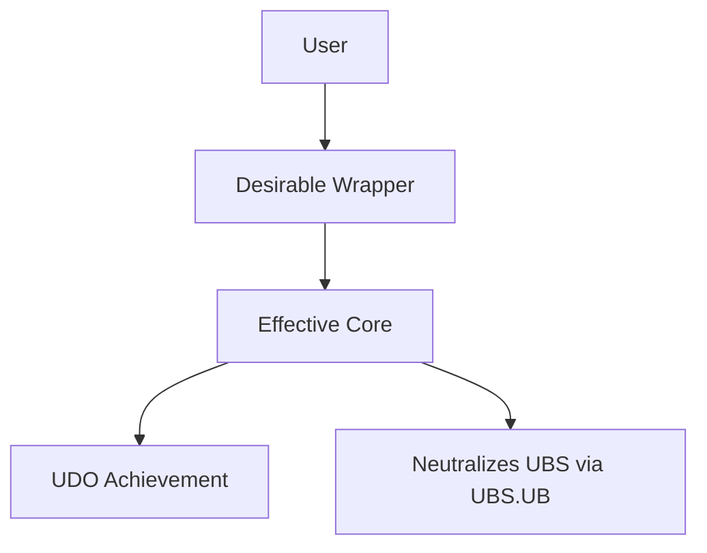

# Design — ESD Phase 2 Architecture

> **ESD Phase:** System Design → Physical/Digital Architecture
> 
> This document captures **how** the system is built. The **what** and **when** live in Requirements and Planning. For methodology, reference `docs/ai/frameworks/effective-system-design.md` §2.

---

## Quick Reference: Design-to-Requirements Mapping

| Design Section | Derives From | Outputs To |
| :--- | :--- | :--- |
| **Principles** | Requirements Phase 2 (EPS) | Component Mapping decisions |
| **Environment** | Requirements Phase 2 (UES) | Wrapper/Core implementation context |
| **Tools** | Requirements Phase 2 (Wrapper/Core concept) | Technical Architecture §2 |
| **EOP** | Requirements Phase 2 (EOP outline) | System Wiki §6 (detailed EOP after I4) |
| **Effectiveness Attributes** | Requirements Phase 3 (Adjectives) | Implementation strategy per A.C. |
| **Resource Impact** | Planning §3 (Budget Tracker) | Hard limits for execution |

*Iteration mapping (ESD §6):* Desirable Wrapper = Iterations 1–2 (Concept, Prototype); Effective Core = Iterations 3–4 (MVE, Leadership). Planning assigns A.C.s to iterations per ESD §6.

*For UBS/UDS/EPS definitions, see ESD §1.3.*

---

# 1. THE SYSTEM DESIGN (Context & Bridge)
*ESD §2: Map the approved Phase 2 from Requirements into physical/digital space.*

**Source:** EPS (Effective Principles), UES (Ultimate Enabling System), EOP outline from Requirements Phase 2.

* **Principles (Why):** [The general and/or scientific principles governing the drivers and blockers — from EPS]
  * *ESD labels:* `P1(S)`, `P2(S)` (Sustainability), `P3(E)`, `P4(E)` (Efficiency), `P5(Sc)`, `P6(Sc)` (Scalability)
* **Environment (Where):** [The physical/digital/cultural context where the solution/enablement lives — UES layers: Foundational / Operational / Enhancement]
* **Tools (What):** 
  * *Desirable Wrapper:* [The hook/interface the user interacts with — aligns with UDO from Requirements Phase 1]
  * *Effective Core:* [The hidden mechanic solving the root drivers/blockers most effectively — neutralizes UBS via UBS.UB principles]
* **EOP (How):** [The step-by-step user action required to use the Tools in the Environment — **conceptual outline here; detailed EOP with per-step RACI in System Wiki §6 after I4 completion**]

---

# 2. TECHNICAL ARCHITECTURE (The Noun)
*ESD: Provide clear, material explanation of the architecture.*

**Goal:** Explain how the Wrapper and Core physically operate.

* **Feature Noun:** [What specific Tool/Solution/Enablement are we building?]

## 2.1 Visual Map (Mermaid)
*ESD: Map user flow, Desirable Wrapper (UI/Client), and Effective Core (Backend/Logic)*

*[Insert feature-specific Mermaid diagram]*

## 2.2 Component Mapping
*ESD: Map to Effectiveness Attributes (Sustainability, Efficiency, Scalability)*

* **Wrapper Implementation:** [How the UI/UX is built to act as the Desirable Wrapper — aligns with `SustainAdj-AC*`, `EffAdj-AC*`, `ScalAdj-AC*`]
* **Core Implementation:** [How the backend logic/scripts act as the Effective Core — implements `P[n](S/E/Sc)` principles]

## 2.3 Data Models & APIs
*ESD §2.3: Define inputs, outputs, database schema. Apply Data Science best practices where applicable.*

[Define the inputs, outputs, and database schema. Explain materially why this data structure is the most effective choice.]

*Where applicable, apply Data Science best practices: Data Collection, Data Management, Descriptive Analytics, Diagnosis Analytics, Predictive Analytics, Prescriptive Analytics.*

---

# 3. EFFECTIVENESS ATTRIBUTES OF THE SOLUTION / ENABLEMENT (The Adjectives)
*ESD: How feature attributes enable the user to reach the Effectiveness Outcomes (Adverbs from Requirements Phase 3).*

**Mapping:** Map each attribute below to the corresponding Requirements A.C. IDs (e.g., `SustainAdj-AC1`, `EffAdj-AC1`, `ScalAdj-AC1`) and to the Planning iteration where that A.C. is validated.

* **Design defines how; Requirements and Planning define what and when.**

* **Sustainability (Risk/Safety):** [List Adjectives + Exact Implementation Strategy — e.g., "Encrypted: AES-256 at rest"; maps to `SustainAdj-AC*`]
* **Efficiency (Speed/Utility):** [List Adjectives + Exact Implementation Strategy — e.g., "Automated: CI/CD pipeline"; maps to `EffAdj-AC*`]
* **Scalability (Growth):** [List Adjectives + Exact Implementation Strategy — e.g., "Modular: microservices"; maps to `ScalAdj-AC*`]

---

# 4. RESOURCE IMPACT (The "Price Tag")
*ESD §4: Monitor constraints mapped to Efficiency Adjectives. Tracked in Planning §3 (Resource & Budget Tracker).*

* **Financial Cost (OpEx):** [Estimated monthly/fixed costs — e.g., "$X/month for hosting"]
* **Build Complexity:** [Low/Medium/High — map to `EffAdv-AC*` (e.g., "Frugally" may imply Low complexity)]
* **ROI Sanity Check:** [Does this architecture respect the Principle of Efficiency? `P3(E)`: Maximize de-risking at current resources; `P4(E)`: Maximize outputs at current resources]

**Requesting Resources / Budget from the User (optional):** When the design or execution requires a budget increase, new tool, or paid service:
1. **When to ask:** Before committing to a task that exceeds current limits (e.g., new API, hosting, paid tier). Do not assume; request explicit approval.
2. **What to specify:** Amount or ceiling (e.g., $X/month, Y API calls/day), purpose (which A.C. or task it serves), and alternative if the User says no.
3. **Approval gate:** Do not spend or integrate until the User approves. Record the approved limit in Planning §3 (Hard Limit) and proceed. If the User declines, adjust scope or task (e.g., mark 🟠 Stuck and propose an alternative).

---

## Post-Iteration 4: System Wiki

**When Iteration 4 completes, the detailed operational record is created:**

* **System Wiki:** `docs/ai/wiki/system-{name}.md` (from `docs/ai/frameworks/system-wiki-template.md`)
* **Filled sections:** Document Control (§0.1), RACI (§2), EOP with per-step RACI (§6), Core Values (§3.4), KPIs (§0.5), Version History (§0.8)
* **Trigger:** `execute-micro-task.md` §3 — Iteration 4 final completion

*For methodology, see `docs/ai/frameworks/effective-system-design.md` §2 and `docs/ai/frameworks/system-wiki-template.md`.*
