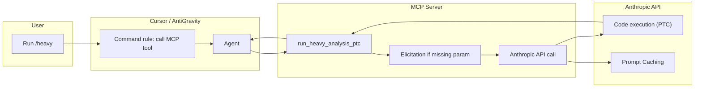

# 1. THE SYSTEM DESIGN (Context & Bridge)
*This section maps the approved Phase 2 from the Requirements document into the physical/digital space.*

* **Principles (Why):** Accuracy (no guessing—MCP Elicitation for missing critical params); Cost (delegate heavy work, saved cacheable static block for Prompt Caching); Speed (one MCP call per heavy task; Context Compaction documented for long-session use).
* **Environment (Where):** Cursor or other IDE (e.g. AntiGravity) on the user's machine; a local MCP server; Anthropic API (cloud). Cultural: Solo operator; LTC 2-State Engine.
* **Tools (What):** 
  * *Desirable Wrapper:* One MCP tool (e.g. `run_heavy_analysis_ptc`) invoked when the user runs a **dedicated command** (e.g. `/heavy` or `/ptc`). The command instructs the agent to call the MCP tool with the user's prompt and scope; same contract for any IDE that supports MCP and a command (Cursor, AntiGravity).
  * *Effective Core:* MCP server uses Elicitation when a critical param is missing; calls Anthropic API with code execution (PTC) so the model never sees full file contents; sends a saved, cacheable static block with each request (Prompt Caching); Context Compaction documented for when long-session API use is designed.
* **SOP (How):** User runs dedicated command → Agent calls MCP tool with prompt and scope → If critical input missing, MCP Elicitation prompts user → MCP server calls Anthropic API (cacheable block + user message) → Claude runs code (PTC), returns only summary → MCP server returns summary to IDE.

---

# 2. TECHNICAL ARCHITECTURE (The Noun)
*Goal: Provide clear, material explanation of the architecture so the User fully understands how the Wrapper and Core physically operate.*

* **Feature Noun:** An MCP server exposing one tool (`run_heavy_analysis_ptc`), plus a dedicated IDE command (e.g. `/heavy`) that triggers the agent to call that tool; the server calls the Anthropic API with code execution (PTC), optional Elicitation, and a cacheable static block.

## 2.1 Visual Map (Mermaid)

## 2.2 Component Mapping
* **Wrapper Implementation:** Dedicated command (e.g. `.cursor/commands/heavy.md`) instructs the agent to call the MCP tool with the user's prompt and scope and not to read many files. MCP server exposes one tool with input schema (prompt, optional scope/paths). Contract documented so any IDE (Cursor, AntiGravity) can invoke the same tool the same way.
* **Core Implementation:** MCP server (e.g. Node or Python) receives tool calls; if a critical parameter is missing, uses MCP Elicitation to prompt the user; reads workspace files or receives paths; calls Anthropic Messages API with code execution tool and (optionally) a tool with `allowed_callers: ["code_execution_20260120"]`; sends a saved, cacheable static block (e.g. summarizer instructions) with each request; parses API response and returns only the summary (or structured result) to the IDE.

## 2.3 Data Models & APIs
* **Inputs:** Tool input: `prompt` (string), optional `scope` or `paths` (array/directory). API key: `ANTHROPIC_API_KEY` in server env.
* **Outputs:** Tool result: summary string (or structured output) to the IDE. No database; state is the tool invocation and the API response.
* **API contract:** Anthropic Messages API with `code_execution_20260120`; optional custom tool (e.g. read_file_content) with `allowed_callers: ["code_execution_20260120"]`; cacheable system/block for Prompt Caching.

---

# 3. EFFECTIVENESS ATTRIBUTES (The Adjectives)
*Map to Requirements A.C. and Planning iterations.*

* **Sustainability (Risk/Safety):** Elicitation-gated (SustainAdj-AC1, SustainAdj-AC2, SustainAdv-AC1, SustainAdv-AC2 → Iteration 2). For any critical parameter, server uses MCP Elicitation; no guess or default. Implementation: MCP server checks required params before calling API; if missing, triggers Elicitation; after user provides input, continues and returns result or clear error.
* **Efficiency (Speed/Utility):** Cacheable, summary-only (EffAdj-AC1, EffAdj-AC2, EffAdv-AC1, EffAdv-AC2, EffAdv-AC3 → Iteration 3). Server maintains saved static block, sends with each API request; tool result to IDE is summary or structured output only. Implementation: static block in code/config; single MCP call completes heavy task; agent does not perform many file-read tool calls for the same task.
* **Scalability (Growth):** Extensible for long sessions (ScalAdj-AC1, ScalAdv-AC1, ScalAdv-AC2 → Iteration 4). Trigger and MCP contract defined for any compatible IDE (ScalAdj-AC2 → Iteration 1). Context Compaction documented for when long-session API use is implemented. Implementation: document Context Compaction in design/requirements; document repeated-use behavior.

---

# 4. RESOURCE IMPACT (The "Price Tag")
* **Financial Cost (OpEx):** Pay-per-use Anthropic API (no fixed subscription required). MCP server runs locally; no hosting cost for server itself.
* **Build Complexity:** Medium (MCP server + API integration + command + optional Elicitation).
* **ROI Sanity Check:** Yes. Reduces Cursor context and can reduce total cost for heavy tasks; Prompt Caching reduces API cost for repeated use.

*Ongoing tracking:* See Planning §3 (Resource & Budget Tracker).

**Requesting Resources / Budget:** If Anthropic API usage or a paid tier is needed, ask the User before committing; specify ceiling and purpose; do not spend until User approves.
