# 1. THE SYSTEM DESIGN (Context & Bridge)
*Maps the approved Phase 2 from the Requirements document into the physical/digital space.*

* **Principles (Why):**
  * P1 — Single Source of Truth: one canonical definition per concept, one canonical location per file.
  * P2 — Defense in Depth: every hard rule has both a markdown layer (AI reads) and a programmatic layer (shell enforces).
  * P3 — Cognitive Economy: proprietary terms only where no industry equivalent exists; Glossary is the single reference.
  * P4 — Ship-to-Learn: every engine element must serve the path from idea to live product.
  * P5 — Environment Portability: all logic lives in `engine/`; IDE-specific folders are thin adapters pointing inward.

* **Environment (Where):** Digital — Cursor IDE, Claude Cowork, AntiGravity, any future MCP-capable environment. Git (version control), local filesystem (docs), bash (guardrails). Cultural — solo non-technical operator; all enforcement must work without the user understanding the code.

* **Tools (What):**
  * *Desirable Wrapper:* The existing Utility Belt unchanged (`/state-a`, `/state-b`, `/status`, `/ship`, `/debug`, `/handoff`, `/review`, `/remember`, `/help`, `/heavy`). No new commands. The engine improves underneath, invisibly to the user's workflow.
  * *Effective Core:* Five mechanisms operating together — Cleanup Pass, Portable Core extraction, Guardrail Layer, Vocabulary Pass, Ship Skeleton.

* **SOP (How):**
  1. User runs `/state-b` — agent executes one atomic task, presents evidence, hard-stops.
  2. Cleanup tasks: agent deletes/moves files → presents `git rm` output and directory listing.
  3. Portable core tasks: agent creates/migrates files → presents file tree and content diff.
  4. Guardrail tasks: agent writes script/hook → runs it → presents terminal output.
  5. Vocabulary tasks: agent rewrites doc → presents before/after term diff.
  6. Skeleton tasks: agent creates folder/files → presents structure and explains what goes where.
  7. User approves each. At completion: clean engine, enforced rules, portable across IDEs, ship-ready.

---

# 2. TECHNICAL ARCHITECTURE (The Noun)

* **Feature Noun:** The hardened, portable, indefinitely-scalable LTC 2-State Execution Engine.

## 2.1 Visual Map (Mermaid)

```mermaid
graph TD
    ROOT[Repo Root] --> ENGINE[engine/ — Portable Core]
    ROOT --> CURSOR[.cursor/ — Cursor Adapter]
    ROOT --> CLAUDE[CLAUDE.md — Cowork Adapter]
    ROOT --> DOCS[docs/ai/ — Holy Trinity]
    ROOT --> TOOLS[tools/ — MCP Servers]
    ROOT --> TESTS[tests/ — Test Skeleton]
    ROOT --> DEPLOY[deploy/ — Deploy Skeleton]
    ROOT --> ARCHIVE[claude-code-course-transcript/ — Learning Archive]
    ROOT --> SETUP[setup.sh — One-command guardrail install]
    ROOT --> CHECK[check-engine.sh — Structural validator]
    ROOT --> CHECKLIST[new-venture-checklist.md]

    ENGINE --> ESKILL[engine/SKILL.md — Single AI Entry Point]
    ENGINE --> ECMDS[engine/commands/ — All command logic]
    ENGINE --> ERULES[engine/rules/ — All hard rules]
    ENGINE --> EREFS[engine/skills/dev-lifecycle/references/ — State A & B logic]

    CURSOR --> CPTR[.cursor/commands/*.md — One-liner + See: pointer only]
    CURSOR --> CMCP[.cursor/mcp.json — MCP server config]

    DOCS --> REQ[requirements/]
    DOCS --> DES[design/]
    DOCS --> PLAN[planning/]
    DOCS --> FW[frameworks/]
    DOCS --> EX[examples/]

    TESTS --> RUNNER[tests/run-tests.sh — Called by /ship]
    DEPLOY --> DREAD[deploy/README.md — Vercel / Railway / CF Workers]

    subgraph IDE_ADAPTERS [IDE Adapters — thin, bolt-on]
        CURSOR
        CLAUDE
    end

    subgraph GUARDRAILS [Programmatic Guardrails]
        SETUP
        CHECK
        HOOK[.git/hooks/pre-commit — Blocks bad commits]
    end
```



## 2.2 Component Mapping

**Portable Core (`engine/`):**
The single source of truth for all engine logic. Any AI agent — in any environment — reads `engine/SKILL.md` as its entry point and navigates to the relevant sub-file from there. No IDE knowledge required. The folder is entirely self-contained: no imports, no hardcoded references to `.cursor/`, `CLAUDE.md`, or any other IDE-specific path.

Structure:
```
engine/
  SKILL.md                          ← single AI entry point
  commands/                         ← all command logic (state-a, state-b, status, ship, debug, handoff, review, remember, help, heavy)
  rules/                            ← anti-patterns.md, ambient-flow.md, context-preservation.md
  skills/
    dev-lifecycle/
      references/                   ← strategy-mapping.md, execute-micro-task.md, worktree-setup.md
      scripts/                      ← check-status.sh, check-docs.sh
  README.md                         ← how to add a new IDE adapter (one paragraph per IDE)
```

**Cursor Adapter (`.cursor/`):**
Thin pointer layer only. Each `.cursor/commands/{name}.md` file contains exactly: one-line description + `See: engine/commands/{name}.md`. The `.cursor/mcp.json` stays here (Cursor-specific config). No logic lives in `.cursor/`.

**Claude Cowork / Claude Agent Adapter (`CLAUDE.md`):**
A single file at repo root that loads engine context for any Claude-based agent (Cowork, Claude Code, Claude API agents). Contains: project name, engine entry point path (`engine/SKILL.md`), how to invoke State A and State B by name, and the approval phrases table. Any Claude agent that reads `CLAUDE.md` on session start knows exactly how to operate the engine.

**AntiGravity Adapter (`.antigravity/` or README section):**
A README adapter section (and optional stub folder) documenting how to point AntiGravity at `engine/SKILL.md`. Adding this adapter requires zero changes to `engine/`.

**Guardrail Layer:**
- `setup.sh` — Single copy-paste command that installs the pre-commit hook and makes `check-engine.sh` executable. Plain-English output confirms what was installed.
- `check-engine.sh` — Validates: (a) all canonical files/folders present, (b) no legacy artifact paths (hardcoded list of known dead paths), (c) no broken `See:` cross-references in `.cursor/commands/`, (d) `engine/` free of IDE-specific path strings. Exit 0 = pass. Non-zero = plain-English violation list.
- `.git/hooks/pre-commit` — Installed by `setup.sh`. Blocks: (a) code file commit without corresponding `docs/ai/design/` doc, (b) `.env` / common secrets-pattern file commits. Prints plain-English error on block. Runs in < 3 seconds.

**Ship Skeleton (`tests/`):**
- `tests/run-tests.sh` — Called by `engine/commands/ship.md` before proposing commit. On first use: prints "No tests defined yet — add test scripts here" and exits 0 (non-blocking). Once test scripts are added: runs them; non-zero exit blocks `/ship` and the agent reports which tests failed.

**Deployment Skeleton (`deploy/`):**
- `deploy/README.md` — Three deployment patterns, each ≤ 10 lines: Vercel (frontend), Railway (backend), Cloudflare Workers (edge). Each entry has "what you do" (1–2 user actions) and "what the AI does for you" (what State B handles).

## 2.3 Data Models & APIs

This feature is pure engine infrastructure — no database, no external API beyond existing MCP servers (already in `tools/`). The "data model" is the document schema:

**Holy Trinity Document Schema (unbounded):**
- `docs/ai/requirements/feature-{name}.md` — Phase 1 (System Map) + Phase 2 (System Design) + Phase 3 (Formalization with A.C. table). No row cap on A.C. tables.
- `docs/ai/design/feature-{name}.md` — Architecture, Component Mapping, Data Models, Effectiveness Attributes, Resource Impact.
- `docs/ai/planning/feature-{name}.md` — Iterative Roadmap, Master Scope Mapping (Table A + Table B, no row cap), Execution Matrix (4 iterations minimum, tasks unbounded per iteration with explicit "add rows as needed" note), Resource & Budget Tracker.

**Planning Doc Scalability Note (enforced in template):**
The Execution Matrix must include this note at the top of each iteration block: *"Add task rows as the feature requires; there is no maximum."* This prevents the agent from self-limiting at ~25 tasks. A feature with 50+ A.C. and 60+ tasks across 4 iterations is structurally valid and expected for complex products.

**Multi-Feature-Set Pattern:**
When a live (I4) product needs new capabilities, a new `feature-{name}` set is started with its own independent I1→I4 cycle. The engine supports unlimited concurrent and sequential feature sets within one product repo. Each feature set has its own Holy Trinity docs. The `new-venture-checklist.md` documents this pattern explicitly.

---

# 3. EFFECTIVENESS ATTRIBUTES (The Adjectives)

*Maps each attribute to Requirements A.C. IDs and Planning iterations.*

**Sustainability (Risk/Safety) — SustainAdj-AC1, SustainAdj-AC2 → Iteration 2:**
- Self-validating via `check-engine.sh` (4-category structural check, machine-readable exit code, human-readable violation list).
- Zero-friction activation via `setup.sh` (single copy-paste command, plain-English confirmation output).
- Implementation: bash scripts; no external dependencies; runs on any Unix-like system (macOS, Linux, WSL).

**Efficiency (Speed/Utility) — EffAdj-AC1, EffAdj-AC2, EffAdj-AC3 → Iterations 1 & 3:**
- Lean via pointer-only `.cursor/commands/` (one-liner + `See:` path; all logic in `engine/commands/`).
- Lean via legacy deletion (`legacy_codeaholic/` removed, `docs/ai/archive/` cleaned, ai-devkit vestige folders removed).
- Lean via command file size constraint (≤ 30 lines per command file; zero inline duplication).
- Implementation: file deletions in I1; file migrations and rewrites in I3.

**Scalability (Growth) — ScalAdj-AC1, ScalAdj-AC2, ScalAdj-AC3 → Iteration 4:**
- Modular adapters: new IDE = new root file/folder + one README paragraph; zero `engine/` changes.
- Environment-agnostic core: `engine/` grep for IDE-specific strings returns zero matches.
- Unbounded planning: template explicitly states no task cap; validated with 50+ A.C. test doc.

---

# 4. RESOURCE IMPACT (The "Price Tag")

* **Financial Cost (OpEx):** $0. This feature is pure engine work — no new APIs, no new infrastructure, no new paid dependencies. Uses existing Cursor/Cowork sessions.
* **Build Complexity:** Medium. The work is mechanical (delete, migrate, rewrite, create scripts) but there are many files to touch across 25 tasks. Risk of broken cross-references if migration order is wrong — mitigated by sequencing cleanup (I1) before migration (I2).
* **ROI Sanity Check:** High. A clean, enforced, portable engine is the prerequisite for every product that ships through it. Every hour invested here saves multiples in every future feature build.

*Ongoing tracking:* See Planning §3 (Resource & Budget Tracker) for current usage vs limits.
